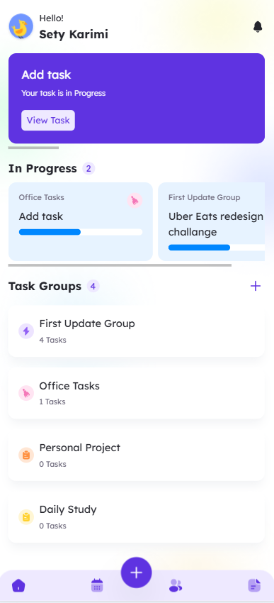

# 🧩 Task Management App (Supabase + React)

A modern **Task Management App** built with **React + TypeScript**, powered by **Supabase** for authentication, database, and storage.  
This project demonstrates full frontend–backend integration with secure policies, file uploads, and relational data.

---

## 🚀 Features

### 🔐 Authentication
- User sign-up and sign-in via **Supabase Auth**  
- Token refresh logic implemented with **Axios interceptors**  
- Access & refresh tokens securely stored in `localStorage`

### 👤 Profile Management
- Each user has a **profile** stored in the `profiles` table  
- Profile includes `name` and `avatar_url`  
- Avatar upload via **Supabase Storage bucket (`avatars`)**  
- Automatic avatar **override** (new upload replaces old one)

### ✅ Task Management
- CRUD operations for tasks (`tasks` table)  
- Task fields: `title`, `description`, `start_date`, `end_date`, `status`, `group_id`  
- Filter tasks by `status` or date (`lte/gte`)  
- Fetch “today’s tasks” with date filters

<p align="center">
  
  
</p>

### 🗂 Task Groups
- `task_groups` table stores groups of tasks  
- Relationship: `tasks.group_id` → `task_groups.id`  
- Each group includes `title`, `description`, `user_id`, `icon` , `color` 
- Displayed dynamically with **Iconsax**  

### 💾 Supabase Policies
- **RLS (Row Level Security)** enabled  
- Users can only **view**, **insert**, **update**, or **delete** their own records

Example policy:
```sql
create policy "Users can view their own tasks"
on public.tasks
for select
to authenticated
using (auth.uid() = user_id);


